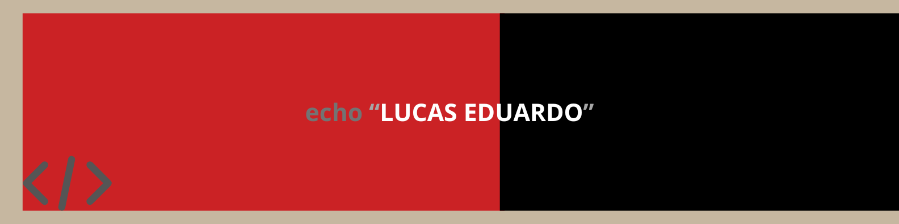

### 👋 Olá!
Sou Lucas Eduardo, estudante e aprendiz do mundo tecnológico. Faz 2 anos que entrei para esse ramo, e estou muito animado em compartilhar meu aprendizado aqui.

### 🎓 Formação e Interesses
Atualmente, estou focado em aprimorar minhas habilidades em [Programação Orientada Objetos, Java, Python, Ciências de Dados], e estou constantemente explorando novos projetos que me desafiem a crescer profissionalmente. Estou no segundo ano do curso de Ciências da Computação.

### 💡 Habilidades e Ferramentas

 
  
  
  
  
  
  

### 🔗 Conecte-se Comigo

 
  
  
  

